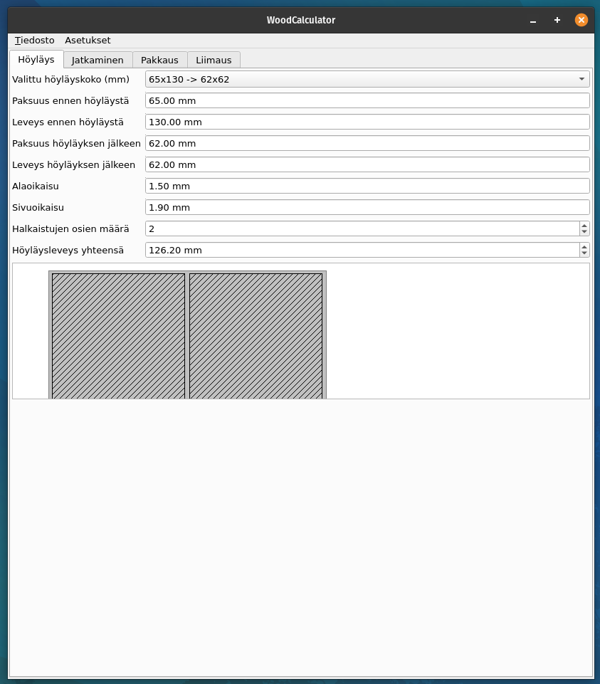
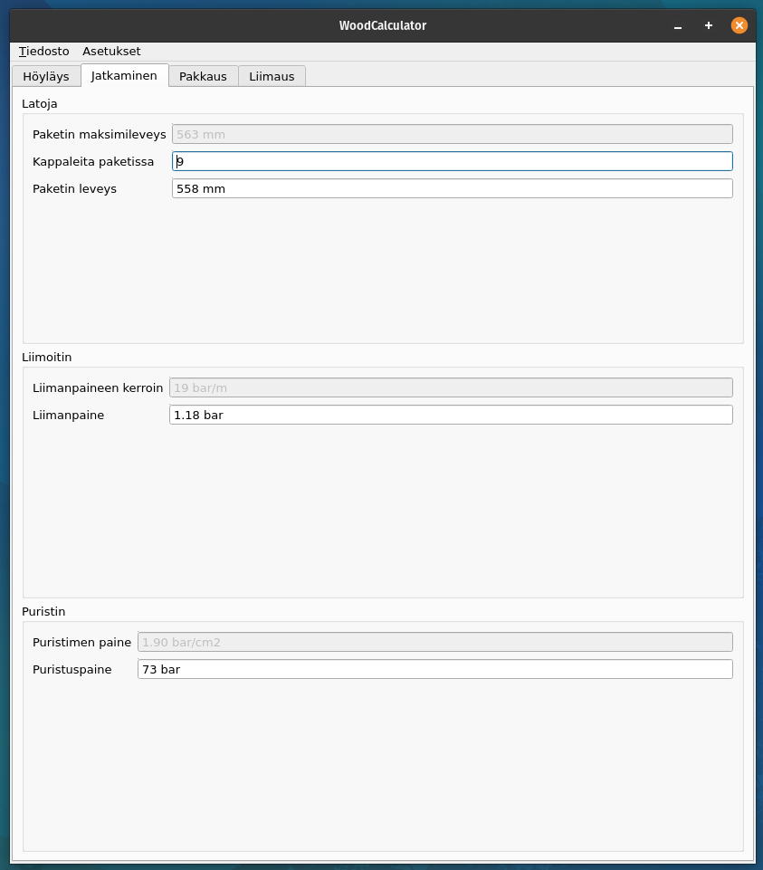
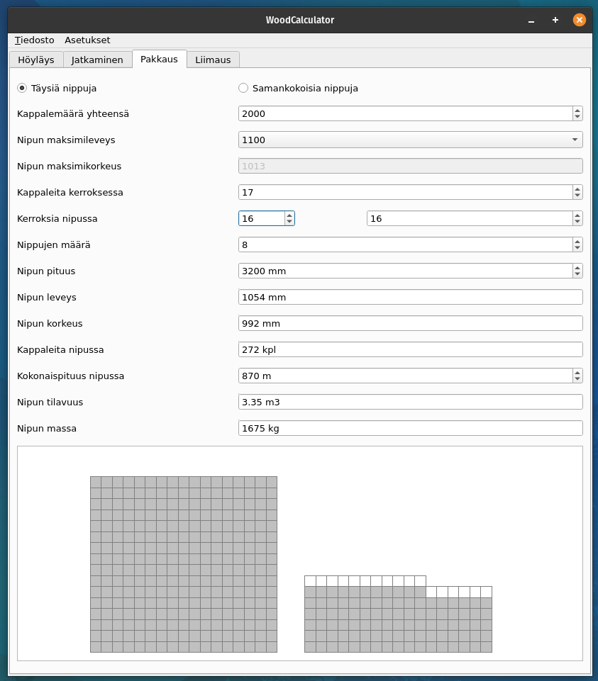
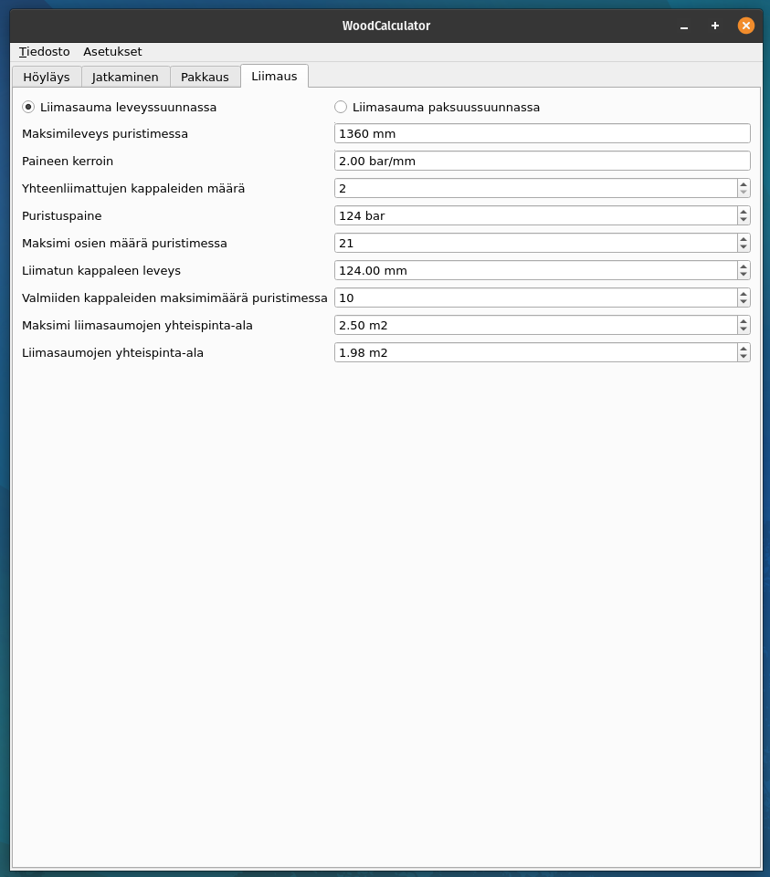

# Wood Calculator

Prototype of application to help calculate several thing used in wood working industry made for learning purposes.

## How Wood Calculator Works

* Calculator calculates unknown values when you type or select known values and draws a drawing to visualize the result.
* You can edit factors used for calculations when enabled from settings

### Planing

### Finger Jointing

### Packaging

### Gluing

## TODO
* Fix drawing of package
* Add creating and removing dimensions of start product

## Used Technologies
* QT
* C++
